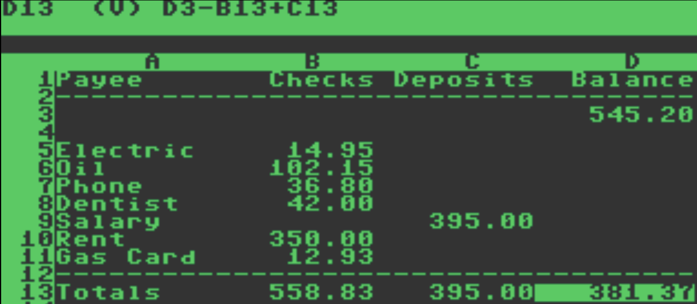

# DerpiCalc



This is an attempt to make VisiCalc for the Commander X16. If Dan Bricklin and
Bob Frankston had a C compiler for the 6502, how much better would their life
have been.

## Building

### llvm-mos

To build using llvm-mos and CMake (my current preference) do normal
CMake things. For instance:

```
mkdir build
cd build
cmake ..
make
```

If llvm-mos can't be found, try `-DCMAKE_PREFIX_PATH=/path/to/llvm-mos` when
invoking CMake.

### CC65 (deprecated)

To build with cc65 (may stop being supported, but works now) use the
Makefile provided. It expects cc65 on your path. If it's not on your path, you
need to modify x16cl65.mak in the parent directory (bottom line is that CC
needs to be able to find the cc65 compiler.)

## References

## Stuff to do

- [ ] Recalculation of other cells when a cell changes
- [ ] @NPV
- [ ] Error handling prints BASIC complaint and halts
- [ ] Scientific notation for constants
- [ ] Explicitly positive / negative constants
- [ ] Scrutinize NA and ERROR
- [ ] Blank cell handling (@AVERAGE and @COUNT specifically)
- [ ] libm soft float implementation?

## Observations on compilers

Right now I am using the [CC65 compiler](https://cc65.github.io/).

But there is a [MOS LLVM / CLANG compiler](https://github.com/llvm-mos/llvm-mos-sdk) also that looks pretty sweet.

I have both running now. The .PRG size for LLVM is 2/3 the size of CC65.

Making LLVM work helped me sort out the mapping between keys and symbols and C
characters.

## Busts out to basic (examples)

* @LN(-1) -- maybe check for negative?
* @TAN(@PI/2) -- hidden division by zero
* @SQRT(-1) -- maybe check for negative?
* @EXP(1234) -- overflow

## Known bugs?

* @INT(0-1.234) -- gives -2, VisiCalc gives -1 (truncation, not rounding)
* @ACOS may be broken. As well as @ASIN
* There are dragons past BK253. You have been warned.
